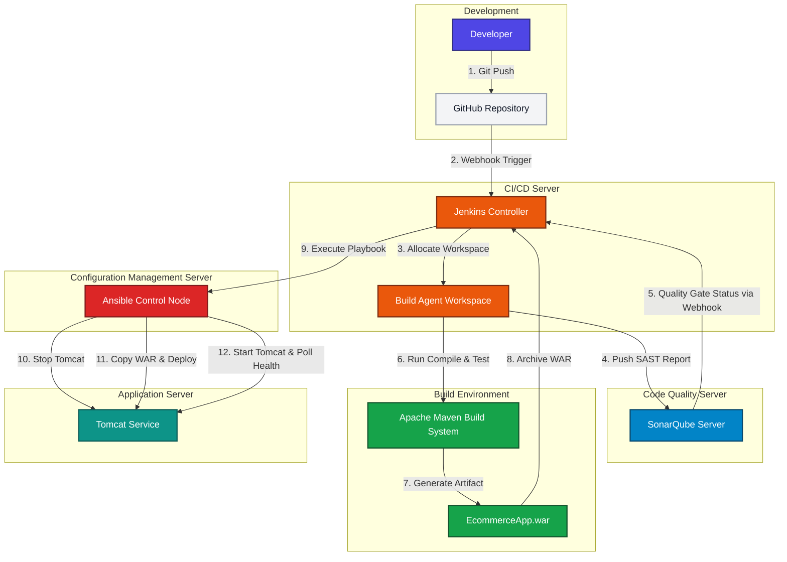
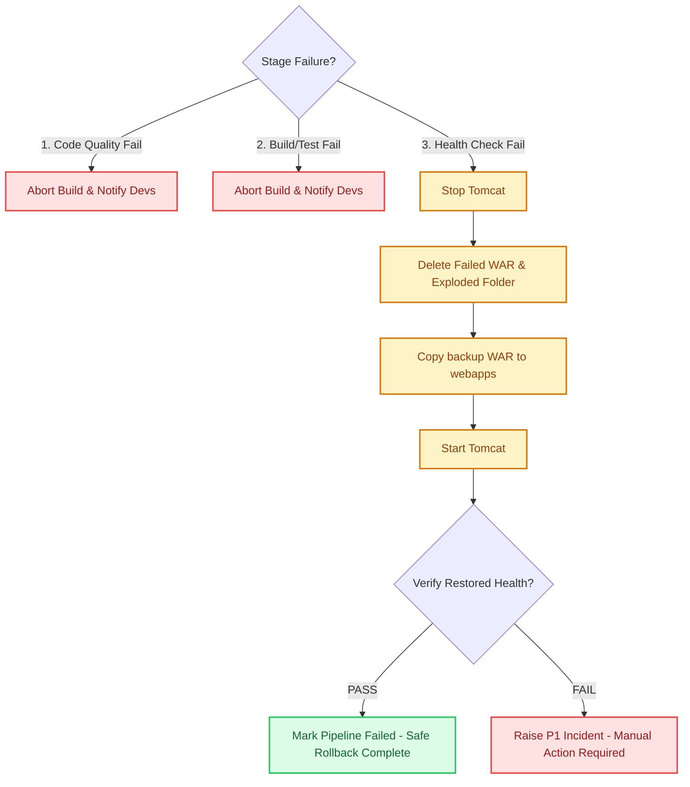

# Enterprise CI/CD Pipeline Design and Implementation Report
**Application:** Java J2EE Ecommerce Application  
**Author:** DevOps Engineering Team  

---

## 1. CI/CD Architecture Diagram

This section outlines the enterprise topology of our DevOps delivery pipeline. The architecture is composed of distinct servers, segregating the responsibilities of source control, orchestration, quality checks, package builds, configuration management, and application hosting.

### Topology Flowchart

### Complete Pipeline Sequence Diagram

The diagram below maps the detailed temporal interactions, data flows, and webhook callbacks across components, demonstrating automated rollback on application health check failure.

```mermaid
sequenceDiagram
    autonumber
    actor Dev as Developer
    participant GH as GitHub
    participant Jen as Jenkins
    participant SQ as SonarQube
    participant Mvn as Maven
    participant Ans as Ansible
    participant App as Tomcat App Server

    Dev->>GH: Git Push Code
    GH->>Jen: Webhook (Build Trigger)
    activate Jen
    Jen->>Jen: Checkout Source Code
    
    rect rgb(30, 41, 59)
        note right of Jen: Stage: Code Quality Validation
        Jen->>SQ: Run static analysis (sonar:sonar)
        activate SQ
        SQ-->>Jen: Analysis Submitted
        deactivate SQ
        Note over SQ,Jen: Wait for Quality Gate (Webhooks)
        SQ->>Jen: Webhook callback (Status = PASS/FAIL)
    end
    
    alt Quality Gate is FAIL
        Jen->>Dev: Notify Build Failure & Stop Execution
    else Quality Gate is PASS
        rect rgb(15, 23, 42)
            note right of Jen: Stage: Build & Package
            Jen->>Mvn: mvn package
            activate Mvn
            Mvn->>Mvn: Run JUnit Tests
            Mvn->>Mvn: Compile & Assemble WAR
            Mvn-->>Jen: Return EcommerceApp.war
            deactivate Mvn
            Jen->>Jen: Archive Artifacts in Jenkins
        end
        
        rect rgb(17, 24, 39)
            note right of Jen: Stage: Ansible Deployment
            Jen->>Ans: Run ansible-playbook
            activate Ans
            Ans->>App: Stop Tomcat Service
            Ans->>App: Backup current WAR
            Ans->>App: Remove old exploded files
            Ans->>App: Copy new EcommerceApp.war
            Ans->>App: Start Tomcat Service
            Ans->>App: Poll Health Check API (HTTP 200)
            
            alt Health Check Fails
                Ans->>App: Stop Tomcat Service
                Ans->>App: Restore backup WAR
                Ans->>App: Start Tomcat Service
                Ans-->>Jen: Exit with Code 1 (Failed Deployment)
                Jen->>Dev: Alert Rollback Succeeded but Deployment Failed
            else Health Check Succeeds
                Ans->>App: Clean up backup files
                Ans-->>Jen: Exit with Code 0 (Success)
                deactivate Ans
                Jen->>Dev: Notify Pipeline Successful Release
            end
        end
    end
    deactivate Jen
```

---

## 2. Complete Pipeline Workflow

The automated software delivery pipeline is written as a declarative pipeline in a `Jenkinsfile` and handles the following sequential stages:

1. **Source Code Checkout**:
   - Triggered automatically via a GitHub webhook on push events to designated branches (e.g., `main` or release branches).
   - Jenkins clones the repository and checks out the specific SHA to ensure auditability and consistent builds.
2. **Static Code Analysis (SAST)**:
   - Jenkins executes `mvn clean compile sonar:sonar`. This compiles the J2EE application bytecode (required by SonarQube for advanced vulnerability scanning) and executes the SonarQube Scanner.
   - Analysis covers:
     - **Bugs**: Identifies null pointer risks, infinite loops, and logic errors.
     - **Vulnerabilities**: Detects OWASP Top 10 vulnerabilities (SQL injections, XSS, etc.).
     - **Security Hotspots**: Highlights lines of code that need security review (e.g., hardcoded parameters, weak cryptography).
     - **Code Smells & Standards**: Checks against J2EE programming guidelines.
3. **Quality Gate Validation**:
   - The pipeline uses Jenkins' `waitForQualityGate()` block. The pipeline goes into a paused state, releasing its build thread.
   - Once SonarQube finishes background analysis, it sends a payload back to Jenkins via a webhook.
   - **PASS**: If all metrics (e.g., 0 critical bugs, test coverage > 80%, security rating A) are met, the pipeline resumes.
   - **FAIL**: If any metric fails, the pipeline exits immediately as a failure, preventing code with defects from building.
4. **Application Build & Package**:
   - Runs `mvn package`. This executes Maven unit tests (JUnit) and bundles the Java classes, web resources (JSPs, HTML/CSS), and libraries into a deployable Web Archive (`EcommerceApp.war`).
   - If tests fail, the build fails. Successful builds write the final package to the local workspace under `target/EcommerceApp.war`.
   - The WAR is archived within Jenkins to preserve execution history.
5. **Deployment Automation (Staging & Production)**:
   - Jenkins runs an Ansible playbook. The playbook manages environment targeting (using `hosts.ini`) and controls server configurations.
   - **Staging**: Deployed automatically upon build success to allow QA testing.
   - **Production**: Uses a manual checkpoint. Jenkins pauses for approval from the release management team before executing the Ansible deployment to live servers.

---

## 3. Tool Integration Design

Our pipeline links GitHub, Jenkins, SonarQube, Maven, Ansible, and Tomcat. The technical integration mechanisms are configured as follows:

| Integration Point | Protocol / Hook | Configuration Detail |
| :--- | :--- | :--- |
| **GitHub to Jenkins** | HTTPS Webhook | GitHub is configured with a Webhook pointing to `https://jenkins.company.com/github-webhook/` triggering on `push` events. |
| **Jenkins to SonarQube** | REST API & Token | Jenkins invokes SonarQube via the Maven plugin using a system-wide SonarQube Server configuration and a secure user token. |
| **SonarQube to Jenkins** | HTTP Webhook | SonarQube is configured with a Webhook pointing back to `https://jenkins.company.com/sonarqube-webhook/` to report Quality Gate statuses. |
| **Jenkins to Maven** | Local Tool Invocation | Jenkins injects configured JDK and Maven installations from its Global Tool Configuration into the runner's path. |
| **Jenkins to Ansible** | SSH / Local Binaries | Jenkins runs the Ansible plugin (or sh shell command) to invoke `ansible-playbook` locally on the Jenkins agent. |
| **Ansible to Tomcat** | SSH (SFTP / SCP) | Ansible control nodes communicate with Tomcat application servers via secure SSH key pairs (port 22). |

---

## 4. Deployment Strategy

We implement a **Recreate with Backup / Rolling Update** deployment strategy:

- **Environment Targeting**: We target staging or production servers using Ansible groups. In production, we deploy to a web server farm (multiple Tomcat nodes). Ansible can perform a rolling update by setting `serial: 1` in the playbook, deploying to one node at a time to prevent downtime.
- **Application Context**: Tomcat automatically explodes (unpacks) any WAR copied into its `webapps` directory. The J2EE Ecommerce Application will run under the context root `/EcommerceApp` (corresponding to the WAR filename `EcommerceApp.war`).
- **Backup & Release Isolation**:
  1. Before touching any running files, Ansible takes a snapshot backup of the current WAR to `/opt/tomcat/backups/EcommerceApp.war.bak`.
  2. The deployment is completed by wiping out the old active WAR and exploded folder, and copying the new WAR.
  3. This prevents classloader caching issues and ensures a clean J2EE servlet context.

---

## 5. Infrastructure Automation Approach

Instead of manual execution steps (such as SFTP transfers or manually logging into Tomcat via SSH to restart services), all actions are orchestrated as Ansible tasks.

- **Systemd Integration**: Ansible manages the state of the J2EE server using the systemd service module, ensuring proper startup/shutdown sequencing:
  - Stops tomcat service to release file locks on the WAR file: `systemctl stop tomcat`.
  - Removes old deployments to avoid residual cache.
  - Places new WAR file.
  - Starts tomcat service: `systemctl start tomcat`.
- **Health Validation**: Ansible verifies application availability locally using the `uri` module. It queries the application's root landing page (`http://localhost:8080/EcommerceApp/`) and waits for a `200 OK` status. This prevents the pipeline from marked as successful if the J2EE application throws runtime exceptions (e.g. database connectivity errors or Servlet init failure) on startup.

---

## 6. Security and Credential Management Approach

To maintain enterprise security compliance, credentials must never be hardcoded in scripts or source repositories.

- **Jenkins Credentials Store**:
  - **SSH Keys**: The SSH private key used by Ansible to log into remote servers is stored as a "Credentials" object in Jenkins (`ansible-ssh-key`). Jenkins injects this key into a secure temporary SSH agent session during build runs.
  - **API Tokens**: SonarQube analysis tokens are stored as secret text in Jenkins.
- **Ansible Vault**:
  - Sensitive environment variables (e.g., database connection passwords, custom TLS certificates, or application configuration settings) are encrypted in the Ansible inventory/host files using **Ansible Vault**.
  - During pipeline execution, the vault password is supplied by Jenkins from a secure credential bind, decrypting values on-the-fly.
- **File System Permissions**:
  - The Tomcat process runs under a dedicated, unprivileged system user (`tomcat`) rather than `root`.
  - Deployment folders are locked down with permissions set to `0755` for directories and `0644` for files, owned by the `tomcat` user.

---

## 7. Failure Handling and Rollback Strategy

An automated deployment process is only as good as its recovery mechanisms. Our pipeline handles failures at each stage to protect environment uptime:

- **Fail-Fast Policy**: If quality analysis or unit testing fails, the pipeline stops. No artifact is built, and no servers are touched.
- **Automated Rollback (Ansible `block`/`rescue`)**:
  - If the new application deployment fails the availability health check (returns 5xx, timeouts, or fails to initialize), Ansible triggers the `Handle Deployment Failure` block.
  - **Restoration**: Ansible shuts down the Tomcat service, purges the failed WAR and its exploded directory, copies the `/opt/tomcat/backups/EcommerceApp.war.bak` file back to the active `webapps` directory, and restarts Tomcat.
  - **Validation**: Ansible verifies the health of the restored application. If the restored application successfully returns HTTP 200, the playbook exits with a failure, reporting a "failed deployment but successful rollback".
  - **P1 Alerting**: If the rollback itself fails to start up, Ansible exits with a critical error code, triggering immediate P1 alerts (Slack/Email/PagerDuty) to the DevOps on-call team for manual intervention.
